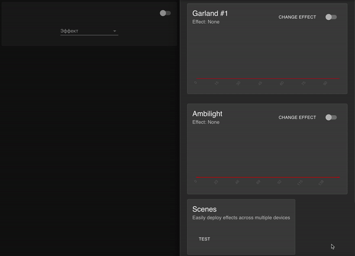

# LedFX for Home Assistant
[](https://github.com/custom-components/hacs)
[](https://paypal.me/dslonyara)
[](https://www.tinkoff.ru/sl/3FteV5DtBOV)

Component for deep integration [LedFx](https://github.com/LedFx/LedFx) from [Home Assistant](https://www.home-assistant.io/).

## Table of Contents
- [FAQ](#faq)
- [Install](#install)
- [Config](#config)
- [Performance](#performance)
- [Screenshots](https://github.com/dmamontov/hass-ledfx/tree/main/screenshots)

## FAQ
**Q. What versions were tested on?**

**A.** So far only [0.10.7](https://github.com/LedFx/LedFx/releases/tag/v0.10.7)

**Q. Does it support audio settings?**

**A.** Yes, it supports

**Q. Can I change the effect settings?**

**A.** You can, for this, enable the appropriate mode from the [PRO] section. The required objects will only be available when supported by the effect.

## Install
Installed through the custom repository [HACS](https://hacs.xyz/) - `dmamontov/hass-ledfx`

Or by copying the `ledfx` folder from [the latest release](https://github.com/dmamontov/ledfx/releases/latest) to the custom_components folder (create if necessary) of the configs directory.

## Config
**Via GUI (Recommended)**

`Settings` > `Integrations` > `Plus` > `LedFx`

For authorization, enter the ip address and port ledfx

**Via YAML (legacy way)**
```yaml
ledfx:
  ip_address: 127.0.0.1
  port: 8888
  scan_interval: 10 # Refresh rate in seconds [PRO]
  timeout: 5 # Request timeout in seconds [PRO]
  ext_effect_settings: False # Advanced effect settings [PRO]
  ext_sensors: False # Additional sensors for device settings [PRO]
```

## Performance


1. Install [lovelace-auto-entities](https://github.com/thomasloven/lovelace-auto-entities) from HACS
2. Install [light-entity-card](https://github.com/ljmerza/light-entity-card) from HACS
3. Add new Lovelace card before that replacing `<your_device_id>`: [example](https://gist.github.com/dmamontov/34d252351d9eda98f53b2d6180771f12)

